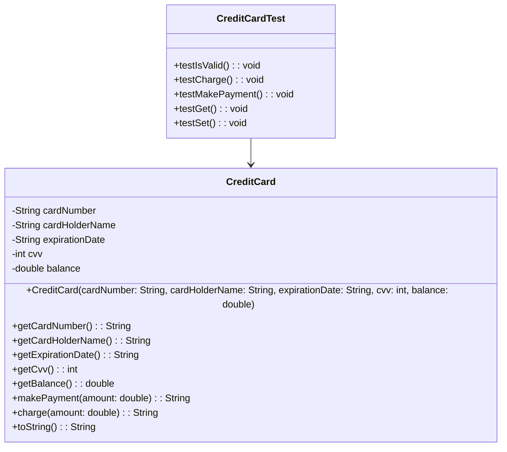
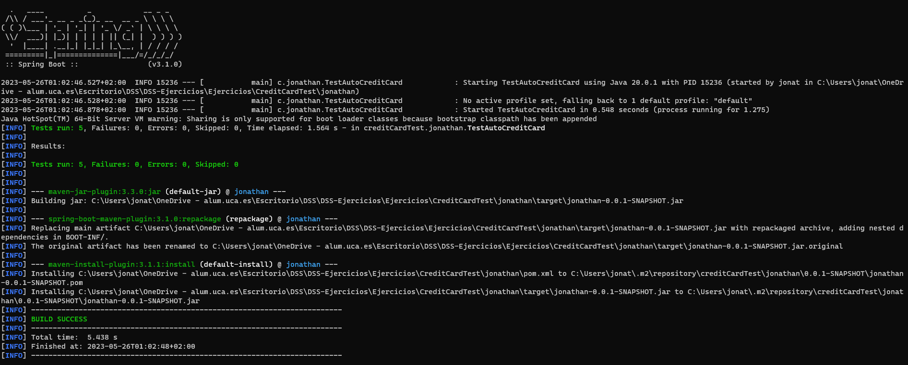

# Tarea 1: CreditCardTest

## Contexto y presentación del problema

Se requiere utilizar el framework **jUnit** para diseñar y codificar una serie de pruebas unitarias para la clase *CreditCard* creada por nosotros. Ësta clase simula la interfaz y el comportamiento de una tarjeta de crédito.

## Solución propuesta

Para dar solución al problema planteado, importamos la biblioteca de **junit** ```import org.junit.jupiter.api.Test;```, así podremos usar *jUnit* para realizar los tests correspondientes.

Antes de mostrar el código, mostraremos su diagrama **UML**.



Por otro lado es la siguiente:

```java
    @Getter
    @Setter
    public class CreditCard {

        private String cardNumber;//num tarjeta
        private String cardHolderName;//titular
        private LocalDate expirationDate;//fecha de expiracion
        private int cvv;//3 digitos detras de la targeta
        private double creditLimit;//limite de credito
        private double balance;//saldo

        public CreditCard(String cardNumber, String cardHolderName, LocalDate expirationDate, int cvv, double creditLimit) {
            this.cardNumber = cardNumber;
            this.cardHolderName = cardHolderName;
            this.expirationDate = expirationDate;
            this.cvv = cvv;
            this.creditLimit = creditLimit;
            this.balance = 0.0;
        }

        public void isValid() {
            LocalDate currentDate = LocalDate.now();

            if (currentDate.isAfter(expirationDate))
                throw new IllegalArgumentException("La tarjeta ha expirado.");
        }

        public String charge(double amount) {
            if (amount <= 0)
                throw new IllegalArgumentException("Cantidad introducida no valida.");

            if (amount > (creditLimit - balance))
                throw new IllegalArgumentException("Limite de credito superado.");

            balance += amount;
            return ("Cantidad ingresada: $" + amount);
        }

        public String makePayment(double amount) {
            if (amount <= 0)
                throw new IllegalArgumentException("Cantidad introducida no valida.");

            if (amount > balance) 
                throw new IllegalArgumentException("No hay suficiente saldo.");

            balance -= amount;
            return ("Cantidad retirada: $" + amount);
        }

        public String toString() {
            String result = "Cardholder: " + cardHolderName + "\n" + "Card Number: " + cardNumber  + "\n" + "Expiration Date: " + expirationDate  + "\n" + "CVV: " + cvv  + "\n" + "Credit Limit: $" + creditLimit  + "\n" +"Balance: $" + balance;

            return result;
        }
    }
```

Una vez creado los [test](/Ejercicios/CreditCardTest/jonathan/src/test/java/creditCardTest/jonathan/TestAutoCreditCard.java) podemos compilar el código para comprobar que efectivamente pasa todos los test.

## Como compilar(Si cambia algún nombre de directorio, debe saber que este tutorial puede fallar)

Para compilar el proyecto, debe situarse en el directorio llamado `jonathan`, una vez situado en el, debe introducir el siguiente comando:

```
    mvn clean install
```

Con esto, se harán todos los test implementados en el proyecto. Le mostrará un mensaje como el siguiente:

<p align="center">

</p>

Como se puede observar en la imágen anterior, nos indica que se han ejecutado correctamente **5 tests**.