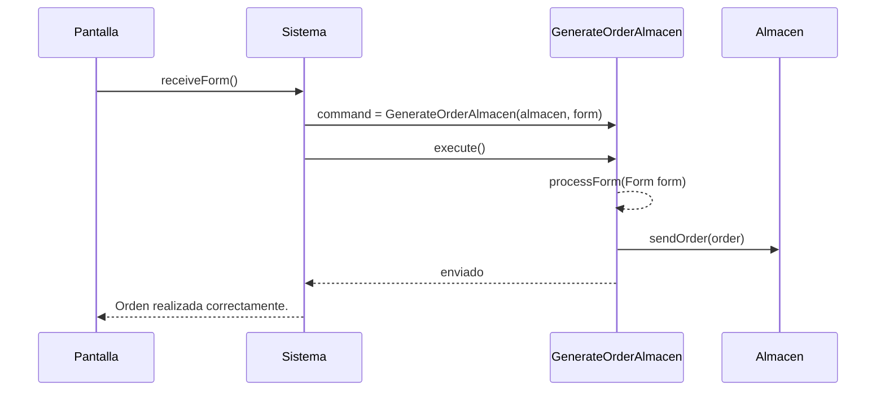
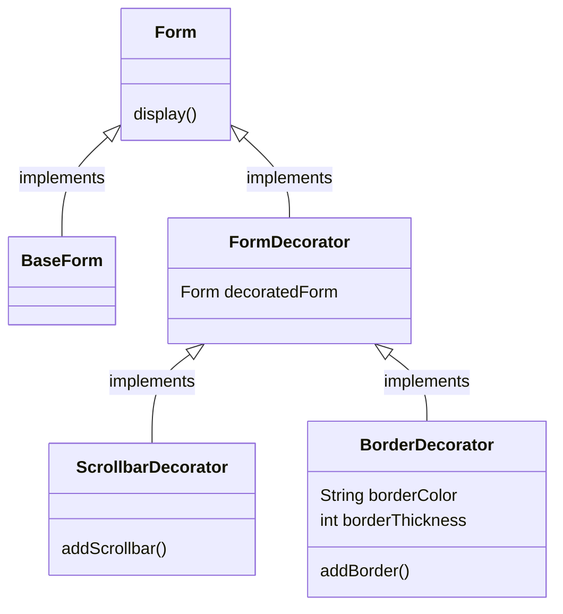

# Tarea 3 Ejercicio de patrones

## Contexto y presentación del problema

Se presenta un problema sobre una empresa distribuidora de productos, esta empresa quiere automatizar el proceso que actualmente hacen de forma manual. Este proceso es generear una orden al almacén, además, solo se generaba un tipo de formulario para hacer una orden al almacén, así que también se pide automatizar este proceso para poder añadirle mayor funcionalidad como realizar ordenes de ventas a clientes entre otros tipos de ordenes.

Para solucionar este problema se nos pide:

a) Aplicar el patrón *command* al dominio del problema propuesto de modo que se permita automatizar el procesamiento del formulario que genera un pedido al almacén, pero contemplando la posibilidad de añadir en el futuro nuevos tipos de formularios produciendo el menor impacto posible en el resto de la aplicación.

b) El diagrama de secuencia que tiene lugar desde que la `empresa` crea el formulario que recoge los datos de un pedido al almacén **(formularioPedido)** hasta que termina su procesamiento en el `almacen`.

c) A la hora de mostrar los distintos formularios en pantalla surgen distintas necesidades, ya que algunos formularios serán más largos que otros, necesitando el uso de la barra de desplazamiento solo los largos. Además se contempla la posibilidad de resaltar algunos de ellos en función de su importancia y/o urgencia con un borde de un determinado color y/o grosor. **Nótese** que un informe que se quiera resaltar con un borde puede también ser largo. **Nótese** también que un formulario puede que se deba resaltar por más de un motivo, lo que implicaría la superposición de varios bordes.
¿Qué patrón de diseño se podría utilizar en este caso de forma que el hecho de cómo se muestra cada formulario pasara desapercibido para el resto del código? Incluir el diseño de dicho patrón


### Aplicando el patrón *Command*

Antes de exponer la solución propuesta, hablemos del *patrón Command*, éste nos permite encapsular una solicitud como un objeto, lo que permite parametrizar otros objetos comn diferentes solicitudes, encolar o registrar solicitudes y admitir operaciones reversibles.

Nuestra solución se basa en crear una interfaz llamada `Command` donde defina un método virtual `execute`. Ej: Si queremos ver un ejemplo en java:

```java
    public interface Command {
        void execute();
    }
```

De esta forma si creamos varios tipos de formularios encapsulados en clases, de tal forma que tengamos una interfaz formulario: `Form`, una interfaz orden: `Orden` y si tenemos una clase para cada tipo de servicio (*almacen*, *cliente ...*), podemos obtener una gran flexibilidad, de forma que creamos una clase para cada orden.

Para dar un ejemplo de código mostraremos como sería la orden para el almacén (**de nuevo con el lenguaje java**):

```java
    public class GenerateOrderAlmacen implements Command {
        private Almacen almacen;
        private Form form;

        public GenerateOrderCommand(Almacen almacen_, Form form) {
            this.almacen = almacen_;
            this.form = form;
        }

        @Override
        public void execute() {
            Order order = processForm(form);
            almacen.sendOrder(order);
        }

        private Order processForm(Form form) {
            // Lógica para procesar el formulario y generar el pedido
            // Puede incluir la validación y transformación de los datos del formulario
            // para crear una instancia de la clase Order
            // Retorna el pedido generado
        }
    }
```

Por último para saber como se realiza una petición mostraremos el ejemplo en java:

```java
    //...
    Form form = receiveForm();
    Command command = new GenerateOrderAlmacen(almacen, form);
    command.execute();
    //...
```

### Diagrama de secuencia



Como podemos ver en el diagrama de secuencia, el sistema dependiendo del formulario llamará al generador de orden correspondiente, en este ejemplo llama al generador de orden de almacén porque no existe otro implementado, pero en el sistema real los habrá y será el sitema el encargado de distribuir el formulario.


### Patrón para los formularios

Hemos elegido el patrón `Decorador` el cuál se basa en añadir nueva funcionad sin modificar el objeto, para este caso, se usará la interfaz `Form` que es común para todos los formularios. De ella se crea una clase base concreta `BaseForm`, es decir, esta clase implementa *Form*. Además de la clase anterior, creamos una clase abstracta `Formdecorator` que implemente la interfaz y actúe como base para los decoradores. 

Con esto obtenemos la flexibilidad de añadir tantos decoradores como queramos:

- Decorador para la barra de desplazamiento `ScrollbarDecorator`
- Decorador para el resaltado con bordes `BorderDecorator`

A continuación mostraremos como quedaría el diseño:

